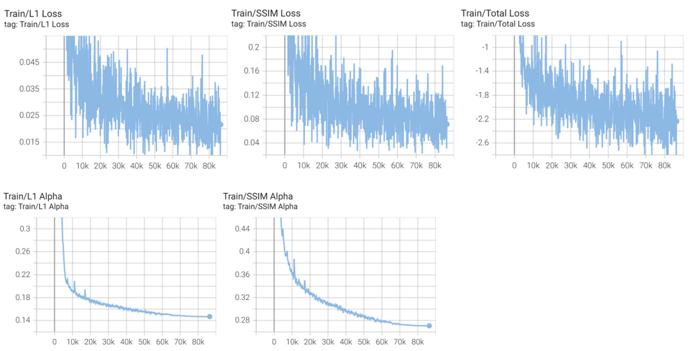
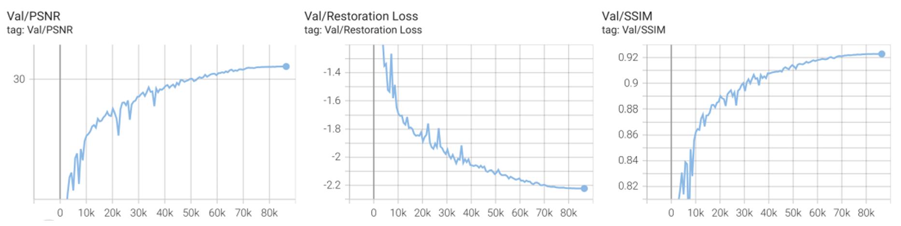
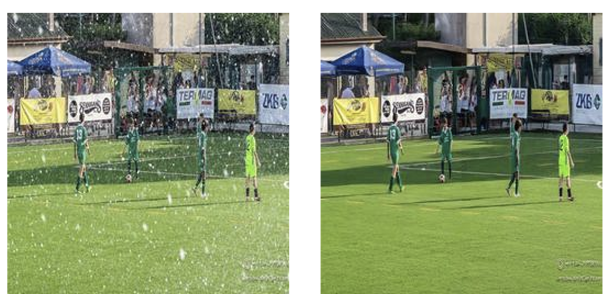

# VDL_Homework4
## Introduction
This is the HW4 in visual deep learning. In this project, we should restore the degraded images from 2 types of degradation, rain and snow, without knowing their actual type. I use `PromptIR` model, the state-of-the-art model for **all-in-one image restoration**, to tackle this task. I adopted the original model structure, but applying the **multi-objective loss function with tunable uncertainty loss weights**.
 
I choose AdamW as the optimizer and apply cosine annealing learning decay with warmup to train the `PromptIR` model from scratch. The detailed hyper-parameters for training is shown as the following:


For inference, rather than feeding the full 256×256×3 image into our model, we first extract overlapping 128×128×3 patches using a 64-pixel stride. At test time, each patch is augmented by rotating it 0°, 90°, 180°, and 270°, restoring each rotated version independently, and then averaging their pixel values to get the patch’s final output. We then stitch all restored patches back together by averaging pixel values in their overlapping areas to reconstruct the full image. Inference experiments show that both patch-wise processing and rotational test-time augmentation significantly improve final performance..


## Project structure
- `hi.py`: is the file for exploring train/test image size -> all are **(256,256,3)**
- `val_utils.py`: is the utility function for computing PSNR and SSIM score
- `data_utils.py`: is the file describe the dataset decriptions and augmentations
- `test.py`: simple inference
- `test_ensemble.py`: is the file for TTA and stride tricks in inferencing.
- python files start with train is the training file with different losses


## How to run the code
- install the dependencies and activate the environment
  ```
  conda env create --file env.yaml
  conda activate DL-Image
  ```
- You can get some examples of training batch with augmentation by running following script, it will generate `example_augmented_images.png`
  ```
  python dataset_utils.py
  ```
- See the model size both UNet-like backbone or SegNet-like backbone
  ```
  python net/model.py
  python net/model_segnet.py
  ```
- training with uncertainty weighted losses (the best of our experiments)
  ```
  python train_uem.py
  ```

- Inference with trained model
  - simple inference (under uncertainty weighted losses)
    ```
    python test.py --method 1 --ckpt_name "YOUR WEIGHT"
    ```
  - complicated inference (under uncertainty weighted losses)
    ```
    python test_ensemble.py --method 1 --ckpt_name "YOUR WEIGHT"
    ```


## Performance

The training record.



<hr>

The validation score of my method.



<hr>

The following is the case compared with degraded image and restored one by my method.



<hr>

The PSNR score on the public leaderboard is **31.23** and the one on the private leaderboard is **30.52**


## Reference
[1] Potlapalli, V., Zamir, S. W., Khan, S. H., & Shahbaz Khan, F. (2023). Promptir: Prompting for all-in-one image restoration. Advances in Neural Information Processing Systems, 36, 71275-71293.

[2]	Zhao, H., Gallo, O., Frosio, I., & Kautz, J. (2016). Loss functions for image restoration with neural networks. IEEE Transactions on computational imaging, 3(1), 47-57.

[3]	Mustafa, A., Mikhailiuk, A., Iliescu, D. A., Babbar, V., & Mantiuk, R. K. (2022). Training a task-specific image reconstruction loss. In Proceedings of the IEEE/CVF winter conference on applications of computer vision (pp. 2319-2328).

[4]	Kendall, A., Gal, Y., & Cipolla, R. (2018). Multi-task learning using uncertainty to weigh losses for scene geometry and semantics. In Proceedings of the IEEE conference on computer vision and pattern recognition (pp. 7482-7491).
 
